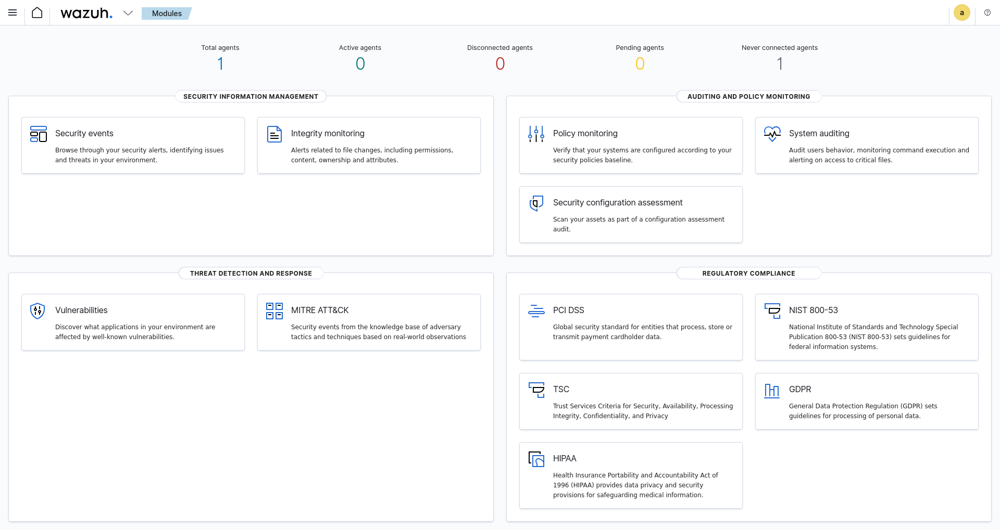

# wazuh-siem

Wazuh SIEM (Security Information and Event Management) deployment on Kali Linux. Real-time threat detection, security event monitoring, and agent management using open source enterprise-grade SIEM.

> All monitoring performed on my own local Kali Linux machine in an isolated VirtualBox environment.

---

## What is Wazuh?

Wazuh is a free open source SIEM used by real SOC teams worldwide. It collects logs from systems, analyses them against thousands of security rules, and generates alerts for suspicious activity — the same way enterprise SIEMs like Splunk and IBM QRadar work.

---

## Environment

- OS: Kali Linux (VirtualBox)
- Wazuh version: 4.7.5
- Components: Wazuh Manager + Indexer + Dashboard
- Date: June 2026

---

## Installation

Wazuh was installed using the official all-in-one installer:

```bash
# Download installer
curl -sO https://packages.wazuh.com/4.7/wazuh-install.sh

# Run all-in-one installation (ignoring OS check for Kali)
sudo bash wazuh-install.sh -a -i
```

Components installed automatically:
- **Wazuh Manager** — analyses logs and generates alerts
- **Wazuh Indexer** — stores all log data (Elasticsearch-based)
- **Wazuh Dashboard** — web interface for viewing alerts

---

## Dashboard

Accessed via browser at `https://127.0.0.1`

### Screenshots

**Main Dashboard**


**Security Events — 55 alerts**


**Security Events — 98 alerts**


---

## Real Alerts Generated

**Total alerts: 15**

| Rule ID | Level | Description | What it means |
|---------|-------|-------------|---------------|
| 502 | 3 | Wazuh server started | Manager startup logged |
| 510 | 7 | Host-based anomaly detection (rootcheck) | Rootkit/anomaly scan completed |
| 533 | 7 | Listened ports changed | New ports opened on system |
| 5402 | 3 | Successful sudo to ROOT | Privilege escalation logged |
| 5501 | 3 | PAM: Login session opened | User login detected |
| 5502 | 3 | PAM: Login session closed | User logout detected |

### Alert severity breakdown

| Level | Count | Meaning |
|-------|-------|---------|
| Level 7 | 10 | Medium-high — requires attention |
| Level 3 | 11 | Low — informational |

---

## Key Findings Analysis

### Rule 533 — Port Change Detection (Level 7)
Wazuh detected new ports opening on the system when the dashboard
and API services started. This is exactly what a SIEM should do —
detect changes in the attack surface.

New ports detected:
```
443   → HTTPS (Wazuh Dashboard)
9200  → Elasticsearch (Wazuh Indexer)
55000 → Wazuh REST API
```

### Rule 510 — Rootcheck Anomaly Detection (Level 7)
Wazuh's rootcheck module scanned the system for signs of rootkits,
trojans, and suspicious files. Level 7 indicates the scan found
something worth investigating.

### Rule 5402 — Sudo Privilege Escalation (Level 3)
Every sudo command is logged with the full command, user, and
working directory. This creates an audit trail of all privileged
operations — critical for forensic investigations.

---

## What I Learned

### SIEM concepts
A SIEM collects logs from multiple sources, correlates them against
rule sets, and generates prioritised alerts. Wazuh uses over 3000
built-in rules covering authentication, file integrity, rootkits,
network anomalies, and compliance standards.

### Alert severity levels
Wazuh uses levels 0-15:
- Level 0-3: Informational
- Level 4-7: Low-medium (requires monitoring)
- Level 8-11: High (requires investigation)
- Level 12-15: Critical (immediate response needed)

### Why SIEMs matter for SOC analysts
Without a SIEM, analysts manually search through thousands of log
files across multiple systems. A SIEM centralises everything,
correlates events automatically, and surfaces only what matters —
reducing alert fatigue and response time.

### Compliance frameworks detected
Wazuh automatically maps alerts to compliance standards:
- PCI DSS — payment card security
- GDPR — data protection
- HIPAA — healthcare data
- NIST 800-53 — security controls
- TSC — trust service criteria

---

## Agent Setup

```bash
# Register local agent
sudo /var/ossec/bin/manage_agents

# List all agents
sudo /var/ossec/bin/agent_control -l

# Check Wazuh status
sudo /var/ossec/bin/wazuh-control status
```

Agent registered:
```
ID: 000  Name: kali (server)  IP: 127.0.0.1  Status: Active/Local
```

---

## Repository Structure

```
wazuh-siem/
├── README.md
├── alerts.log              ← real Wazuh alerts from my system
└── screenshots/
    ├── wazuh_dashboard.png
    ├── security_events_55.png
    └── security_events_98.png
```

---

## Disclaimer

All monitoring was performed on my own local Kali Linux machine
running in VirtualBox. No external systems were monitored.

---

## License

MIT
